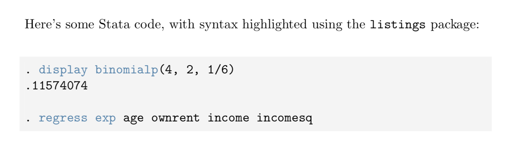

# stata-lstlisting
A more complete Stata markdown style for the LaTeX `lstlisting` package.

## Sources
  - Reserved words: https://www.stata.com/manuals13/m-2reswords.pdf 
  - Built-in function names: https://www.stata.com/manuals/fn.pdf
  - `lstlisting` language style definitions: http://ctan.mirrors.hoobly.com/macros/latex/contrib/listings/lstdrvrs.pdf
 
## How to use
Just `\include{}` or `\input{}` the .tex file in this repository and set the language in your `lstlisting` environment to `Stata`.
```
\begin{lstlisting}[language=Stata, numbers=none]
. display binomialp(4, 2, 1/6)
.11574074
\end{lstlisting} 
```

## Rendered example


## See also
  - https://gist.github.com/kongs-sublime/10862838
